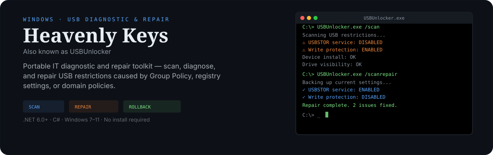

<p align="center">
  
</p>

# Heavenly Keys

**Portable Windows IT Diagnostic and Repair Toolkit**

Also known as *USBUnlocker*. A comprehensive USB mass storage diagnostic and repair tool for authorized administration of Windows systems. It scans, diagnoses, and repairs USB restrictions caused by Group Policy, registry settings, or domain policies — and doubles as a general-purpose IT health toolkit.

## Features

- **USB Scan & Repair** — Detect and repair USB storage restrictions (USBSTOR service, write protection, removable storage policies, device install restrictions, drive visibility)
- **System Diagnostics** — System info, hardware inventory, driver audit, service audit, Windows integrity check
- **Network & Security** — Network diagnostic, security configuration analysis, Windows event log analysis
- **Reporting** — Full diagnostic reports, JSON export, ZIP archive creation
- **Workflows** — Multi-step workflows that chain scan, repair, and verify operations with confirmation prompts
- **Silent Mode** — Batch/automation-friendly mode with exit codes
- **Rollback** — Restore previous USB configuration from backups
- **Dry Run** — Detect issues without making any changes
- **Dynamic Menu** — Auto-generated interactive menu with keyboard shortcuts, search, and capability inspector

## Requirements

- Windows 7, 8, 8.1, 10, or 11
- .NET Framework 4.5+ (included with Windows) or .NET 6.0+ SDK for building
- Administrator privileges for repair operations (diagnostic features work without elevation)

## Quick Start

### Using the Build Script

```bash
build.bat
```

### Using .NET CLI

```bash
dotnet publish USBUnlocker.csproj -c Release -r win-x64 --self-contained true -o dist
```

The output will be at `dist/USBUnlocker.exe`.

### Using Visual Studio

1. Open `USBUnlocker.sln`
2. Select **Release** configuration
3. Build > Publish > Folder publish

## Command-Line Options

| Option       | Description                                      |
|--------------|--------------------------------------------------|
| `/silent`    | Silent batch mode (no interactive UI)            |
| `/scan`      | Scan only, no repair                             |
| `/scanrepair`| Scan and repair USB restrictions                 |
| `/rollback`  | Rollback last repair operation                   |
| `/portable`  | Portable mode (stores data next to the executable)|
| `/debug`     | Enable debug logging to console                  |

Exit codes in silent mode:

| Code | Meaning                              |
|------|--------------------------------------|
| 0    | Success — USB access verified        |
| 1    | USB access still blocked             |
| 2    | Domain-joined machine detected       |
| 3    | External USB device restrictions     |
| 4    | Administrator privileges required    |
| 5    | Fatal error during execution         |

## Interactive Menu

Launch without arguments to enter the interactive menu. The menu is dynamically generated from registered capabilities and organized by category:

```
SYSTEM         -- System info, hardware, drivers, services, integrity
USB            -- Scan, device info, history, repair, verify
NETWORK        -- Network diagnostic
SECURITY       -- Security diagnostic, event log analysis
REPORTS        -- Generate reports, JSON export, ZIP archive, view logs
TOOLS          -- Complete diagnostic, dry run, rollback
AUTO WORKFLOWS -- Chained operations (diagnostic suite, repair pipeline)
```

Keyboard shortcuts:

| Key | Action     |
|-----|------------|
| `S` | Search     |
| `W` | Workflows  |
| `I` | Inspector  |
| `H` | Help       |
| `R` | Refresh    |
| `Q` | Exit       |

## Project Structure

```
Heavenly Keys/
├── src/
│   ├── Program.cs              # Entry point
│   ├── core/
│   │   ├── Application.cs      # Main application loop and menu
│   │   ├── AppConfig.cs        # Configuration and CLI argument parsing
│   │   ├── FeatureRegistry.cs  # Capability/workflow registry and dispatch
│   │   └── Dispatcher.cs       # Input dispatcher
│   ├── ui/
│   │   └── HeaderEngine.cs     # ASCII art header display
│   ├── usb/
│   │   ├── UsbScanner.cs       # USB restriction scanning (registry checks)
│   │   ├── UsbRepairer.cs      # USB restriction repair
│   │   ├── UsbVerifier.cs      # Post-repair verification
│   │   ├── UsbRepairWorkflow.cs# Scan-repair-verify workflow
│   │   ├── UsbDeviceEnumerator.cs
│   │   ├── UsbHistory.cs
│   │   ├── DryRunner.cs        # Simulation mode
│   │   └── RollbackManager.cs  # Backup/restore
│   ├── diagnostics/
│   │   ├── SystemInfoDisplay.cs
│   │   ├── HardwareInfoDisplay.cs
│   │   ├── DriverAuditor.cs
│   │   ├── ServiceAuditor.cs
│   │   ├── IntegrityChecker.cs
│   │   └── CompleteDiagnostic.cs
│   ├── network/
│   │   └── NetworkDiagnostic.cs
│   ├── security/
│   │   ├── SecurityDiagnostic.cs
│   │   └── EventLogAnalyzer.cs
│   ├── reports/
│   │   ├── ReportGenerator.cs
│   │   └── JsonExporter.cs
│   └── utilities/
│       ├── Logger.cs           # File and console logging
│       ├── AdminHelper.cs      # UAC elevation
│       ├── SystemInfo.cs       # OS/arch/domain detection
│       ├── DisplayHelper.cs    # Console UI helpers
│       └── TempManager.cs      # Temporary file cleanup
├── assets/
│   └── ascii_arts.txt          # ASCII artwork for headers
├── build.bat                   # Build script
├── USBUnlocker.csproj          # .NET project file
└── USBUnlocker.sln             # Visual Studio solution
```

## How It Works

1. **Startup** — The tool checks for administrator privileges and prompts for UAC elevation if needed. It detects the Windows version and architecture.

2. **Capability Discovery** — All features are registered as *capabilities* with metadata (admin requirement, risk level, dependencies). The menu is built dynamically from this registry.

3. **Scan** — Reads Windows registry keys to detect USB restrictions: USBSTOR service status, write protection policies, removable storage deny policies, device installation restrictions, and drive visibility policies.

4. **Repair** — Backs up current settings, then modifies registry keys to restore USB access. Each operation is logged.

5. **Verify** — Re-reads registry keys to confirm that restrictions have been lifted.

6. **Reporting** — Generates text reports, JSON data exports, and ZIP archives of all diagnostic results.

## Architecture

The application uses a **capability registry** pattern:

- Features are self-describing `Capability` objects with an ID, category, action delegate, risk level, and dependency list.
- The `FeatureRegistry` auto-generates workflows from compatible capabilities (e.g., "USB Repair Pipeline" chains scan, repair, and verify).
- Context actions appear only when relevant (e.g., "Quick Repair" shows after a scan finds issues).
- The menu, help, search, and inspector are all driven from the same registry — no hardcoded menus.

## License

For authorized administration use only.
